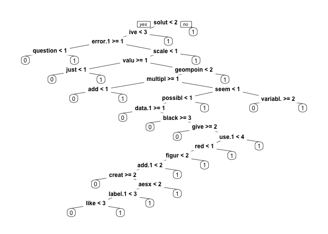
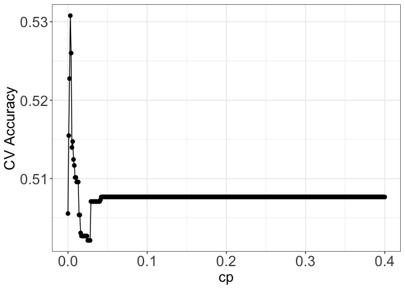

    library(tm)
    library(MASS)
    library(rpart)
    library(boot)
    library(SnowballC)
    library(wordcloud)
    library(caTools)
    library(dplyr)
    library(rpart.plot)
    library(randomForest)
    library(caret)

    ## load the data, and a quick view of data, the data is consisted of Title, Body, score, we'll mainly dig in to Title and Body and infer score
    data = read.csv("ggplot2questions2016_17.csv", sep = ",", stringsAsFactors = FALSE)
    clean_data = data
    head(data,2)

    ##                                       Title
    ## 1                 Missing Ribbon in ggplot2
    ## 2 ggplot - label as calculated increase (%)
    ##                                                                                                                                                                                                                                                                                                                                                                                                                                                                                                                                                                                                                                                                                                                                                                                                                                                             Body
    ## 1                                                                                                                                                 
I seem to be having trouble setting up a ribbon in ggplot2 to display. 
\n\n
Here's a made up data set:
\n\n<pre><code>&gt; GlobalDFData\n  Estimate Upper  Lower  Date   Area\n1      100   125    75 Q1_16 Global\n2      125   150   100 Q2_16 Global\n3      150   175   125 Q3_16 Global\n4      175   200   150 Q4_16 Global\n</code></pre>\n\n
Here's the code that I'm trying with no success. I get the line chart but not the upper and lower bounds
\n\n<pre><code>ggplot(GlobalDFData, aes(x = Date)) + \n  geom_line(aes(y = Estimate, group = Area, color = Area))+\n  geom_point(aes(y = Estimate, x = Date))+\n  geom_ribbon(aes(ymin = Lower, ymax = Upper))\n</code></pre>\n
    ## 2 
I have developed a ggplot graph but now I am trying to add calculated label which shows increase in % year-on-year?
\n\n
My data frame is very simple (result of aggregate from the main dataset)
\n\n<pre><code>'data.frame':   4 obs. of  3 variables:\n $ Year    : int  2011 2012 2013 2014\n $ TotalPay: num  71744 74113 77611 75466\n</code></pre>\n\n
I have a code for my graph:
\n\n<pre><code>library(ggplot2)\nggplot(d1, aes(x=Year, y=TotalPay)) + geom_bar(stat="identity") + \nlabs(x="Year", y="Average Total Pay ($)")\n</code></pre>\n\n
and now trying to use stat_bin for lables? The calculation is Actual Year - Previous Year * 100%. I have this but not sure how to fill percent ()
\n\n<pre><code>stat_bin(aes (labels = paste("Total Pay" = ,scales::percent(())), vjust = 1, geom = "TexT")\n</code></pre>\n
    ##   Score
    ## 1     3
    ## 2     3

1. Data Cleaning  
----------------------

Let’s start with Data Cleaning  

1.  remove
    <html>
    tag, as it’s not meaningful in prediction and add unecessary noise
     
2.  remove $\\n \\t$  
3.  all text convert to lower case  
4.  remove puntunctuation  
5.  remove stopwords(more details will be given at that step)  
6.  stem the documents  

<!-- -->

    ## doing i, ii
    clean_data$Body = gsub("<.*?>", "",clean_data$Body)
    clean_data$Body = gsub("[\n\t]", "", clean_data$Body)

    ## before going to next steps, convert all body to corpus for easier analysis
    corpusBody = Corpus(VectorSource(clean_data$Body))#create corpus

    ## step iii to lower
    corpusBody = tm_map(corpusBody, tolower)#to lower case
    ## step iv remove punctuation
    corpusBody = tm_map(corpusBody, removePunctuation)#remove punctuation

From Wikipedia, Stop words are defined as "“In computing, stop words are
words which are filtered out before or after processing of natural
language data.” In our case, we’ll remove top 10 stop words in English,
as well as “ggplot” and “ggplot2” since they are over common in this
topic

    ## step v 
    stopwords("english")[1:10] # find top stopwords

    ##  [1] "i"         "me"        "my"        "myself"    "we"        "our"      
    ##  [7] "ours"      "ourselves" "you"       "your"

    length(stopwords("english"))

    ## [1] 174

    corpusBody = tm_map(corpusBody, removeWords, c("ggplot2","ggplot", stopwords("english")))

Also from Wikipedia, word steming is defined as “In linguistics, a stem
is a part of a word used with slightly different meanings and would
depend on the morphology of the language in question. In Athabaskan
linguistics, for example, a verb stem is a root that cannot appear on
its own, and that carries the tone of the word”. We’ll apply the steming
to the corpusBody as our last data cleaning process.

    ## step vi stem the documents
    corpusBody = tm_map(corpusBody, stemDocument)

    ## Finally, as an example, let's look at the how the body of our first row are finally converted 
    strwrap(corpusBody[[1]])

    ## [1] "seem troubl set ribbon display here made data setgt globaldfdata estim" 
    ## [2] "upper lower date area1 100 125 75 q116 global2 125 150 100 q216 global3"
    ## [3] "150 175 125 q316 global4 175 200 150 q416 globalher code im tri success"
    ## [4] "get line chart upper lower boundsggplotglobaldfdata aesx date"          
    ## [5] "geomlineaesi estim group area color area geompointaesi estim x date"    
    ## [6] "geomribbonaesymin lower ymax upper"

2. data processing  
------------------------

Next, we are doing the following,   vii) construct the feature
matrix by looking at the sparsity and frequencies of the words.  
viii) do the same procedures on titles   ix) combine the matrix of
textbody and title   

To select the words for learning, we look at their sparsity and
frequencies appearing in the text. we finally select the words as
features by looking at the sparsity and frequencies appearing in the
text. After trying on frequencies ranges from 90%~99%, we found
selecting the words that are appearing in 92% of the text and appearing
more than 1500 times in total works nicely with the models. There are a
total of 95 words satisfying this criteria.  Therefore, A feature
matrix with of 95 columns obtained from the body is constructed as
dfBody

    ## step vii
    frequenciesBody = DocumentTermMatrix(corpusBody)
    frequenciesBody

    ## <<DocumentTermMatrix (documents: 7468, terms: 211509)>>
    ## Non-/sparse entries: 596237/1578952975
    ## Sparsity           : 100%
    ## Maximal term length: 16850
    ## Weighting          : term frequency (tf)

    findFreqTerms(frequenciesBody, lowfreq=1500)

    ##  [1] "100"          "aesx"         "code"         "color"        "data"        
    ##  [6] "get"          "group"        "line"         "tri"          "add"         
    ## [11] "fill"         "graph"        "label"        "show"         "use"         
    ## [16] "variabl"      "axi"          "colour"       "column"       "creat"       
    ## [21] "differ"       "legend"       "like"         "plot"         "size"        
    ## [26] "two"          "want"         "can"          "exampl"       "follow"      
    ## [31] "look"         "bar"          "error"        "make"         "work"        
    ## [36] "chang"        "function"     "class"        "factor"       "name"        
    ## [41] "point"        "time"         "valu"         "one"          "datafram"    
    ## [46] "way"          "elementblank" "nan"          "sim"

    sparseBody = removeSparseTerms(frequenciesBody, 0.92)
    sparseBody

    ## <<DocumentTermMatrix (documents: 7468, terms: 95)>>
    ## Non-/sparse entries: 118756/590704
    ## Sparsity           : 83%
    ## Maximal term length: 9
    ## Weighting          : term frequency (tf)

    dfBody = as.data.frame(as.matrix(sparseBody))
    colnames(dfBody) = make.names(colnames(dfBody))

do the same procedures on titles like what we did to the text body.

    ## step viii
    clean_data$Title =  gsub("<.*?>", "",clean_data$Title)
    clean_data$Title =  gsub("[\n\t]", "", clean_data$Title)  
    corpusTitle = Corpus(VectorSource(clean_data$Title))#create corpus

    corpusTitle = tm_map(corpusTitle, tolower)#to lower case

    corpusTitle = tm_map(corpusTitle, removePunctuation)#remove punctuation

    #remove stopwords
    corpusTitle = tm_map(corpusTitle, removeWords, c("ggplot2","ggplot", stopwords("english")))
    #STEM the document
    corpusTitle = tm_map(corpusTitle, stemDocument)

Similar to how we treat body, by looking at the words that frequently
appear, I finally selected the words that appear in more than 96% of the
titles as the characteristics for Title. Another feature matrix with 20
columns is constructed from the Title corpus.

    ## get sparsity and frequencies
    frequenciesTitle = DocumentTermMatrix(corpusTitle)

    findFreqTerms(frequenciesTitle, lowfreq=120)

    ##  [1] "label"     "add"       "legend"    "plot"      "use"       "object"   
    ##  [7] "error"     "group"     "axi"       "ggplot"    "can"       "chang"    
    ## [13] "map"       "data"      "function"  "graph"     "make"      "line"     
    ## [19] "multipl"   "time"      "boxplot"   "factor"    "facet"     "work"     
    ## [25] "histogram" "base"      "column"    "creat"     "shini"     "colour"   
    ## [31] "color"     "two"       "xaxi"      "scale"     "text"      "remov"    
    ## [37] "variabl"   "valu"      "custom"    "set"       "point"     "size"     
    ## [43] "differ"    "bar"       "barplot"   "show"      "one"       "stack"    
    ## [49] "order"     "fill"      "chart"

    findFreqTerms(frequenciesTitle, lowfreq=80)

    ##  [1] "label"     "add"       "legend"    "plot"      "space"     "use"      
    ##  [7] "object"    "error"     "group"     "axi"       "ggplot"    "can"      
    ## [13] "chang"     "map"       "data"      "function"  "graph"     "make"     
    ## [19] "line"      "multipl"   "display"   "seri"      "time"      "boxplot"  
    ## [25] "factor"    "mean"      "facet"     "work"      "histogram" "titl"     
    ## [31] "base"      "column"    "creat"     "list"      "name"      "shini"    
    ## [37] "grid"      "colour"    "color"     "count"     "two"       "xaxi"     
    ## [43] "scale"     "text"      "remov"     "level"     "variabl"   "valu"     
    ## [49] "combin"    "custom"    "geompoint" "facetgrid" "set"       "tick"     
    ## [55] "point"     "size"      "posit"     "without"   "differ"    "draw"     
    ## [61] "get"       "bar"       "barplot"   "show"      "aesthet"   "number"   
    ## [67] "one"       "area"      "stack"     "yaxi"      "order"     "densiti"  
    ## [73] "fill"      "chart"     "date"      "regress"   "loop"      "facetwrap"
    ## [79] "within"    "datafram"  "frame"     "geombar"

    sparseTitle = removeSparseTerms(frequenciesTitle, 0.96)

    dfTitle = as.data.frame(as.matrix(sparseTitle))
    colnames(dfTitle) = make.names(colnames(dfTitle))

Finally, we constructed the full feature matrix, by merging the feature
matrix obtained from title corpus with the one constructed by body
corpus, with a total of 116 columns, 115 features from body and text,
and 1 column for labeling the usefulness(&gt;=1 as useful, and &lt;1 as
not useful).

    ## step ix) construct the full matrix
    ## Usefulness of each stackoverflow
    clean_data$useful = as.factor(as.numeric(clean_data$Score >= 1))
    #################
    feat_matrix <- cbind(dfTitle,dfBody) 
    df_features <- as.data.frame(feat_matrix)
    df_features$useful = clean_data$useful
    colnames(df_features) <- make.names(colnames(df_features),unique=TRUE)

3.Model fitting, Cross Validation, Model Selections
---------------------------------------------------

We will do the following in this chapter,   x) Train Test Split
  xi) Fit models, including Baseline Model, Random Forest, Logistic
Regression, Stepwise Regression, LDA and CART.   xii) Performance
Analysis and Model selection   

70% train, and 30% test

    ## step x
    splt = sample.split(df_features$useful, SplitRatio = 0.7)
    stackTrain = df_features %>% filter(splt == TRUE)
    stackTest = df_features %>% filter(splt == FALSE)

#### 3a) Baseline Model

    print("based on train set distribution, we'll always predict 0")

    ## [1] "based on train set distribution, we'll always predict 0"

    table(stackTrain$useful)

    ## 
    ##    0    1 
    ## 2654 2574

    confusion_m <- table(stackTest$useful)
    confusion_m 

    ## 
    ##    0    1 
    ## 1137 1103

    base_acc = confusion_m[[1]]/ sum(confusion_m)
    paste("Baseline Model Accuracy: ", base_acc)  

    ## [1] "Baseline Model Accuracy:  0.507589285714286"

#### 3b) Basic random forest

After a few testing, I found using parameters ntree = 500, and mtry = 60
performs best among all, achieving accuracy, TPR, FPR as followed

    stackRF = randomForest(useful ~ ., data=stackTrain, mtry = 60, ntree = 500)  
    PredictRF = predict(stackRF, newdata = stackTest) 
    confusion_m <- table(stackTest$useful, PredictRF)
    confusion_m

    ##    PredictRF
    ##       0   1
    ##   0 640 497
    ##   1 512 591

    rf_acc = (confusion_m[1] + confusion_m[4])/sum(confusion_m)
    rf_TPR = confusion_m[4]/(confusion_m[4] + confusion_m[3])
    rf_FPR = confusion_m[2]/(confusion_m[2] + confusion_m[1])

    paste("Random Forest Accuracy: ", rf_acc) 

    ## [1] "Random Forest Accuracy:  0.549553571428571"

    paste("Random Forest TPR: ", rf_TPR)

    ## [1] "Random Forest TPR:  0.543198529411765"

    paste("Random Forest FPR: ", rf_FPR)

    ## [1] "Random Forest FPR:  0.444444444444444"

#### 3c) Logistic regression

    stackLog = glm(useful ~ ., data=stackTrain, family = "binomial")
    PredictLog = predict(stackLog, newdata = stackTest, type = "response")
    confusion_m <- table(stackTest$useful, PredictLog > 0.5)
    confusion_m 

    ##    
    ##     FALSE TRUE
    ##   0   687  450
    ##   1   539  564

    log_acc = (confusion_m[1] + confusion_m[4])/sum(confusion_m)
    log_TPR = confusion_m[4]/(confusion_m[4] + confusion_m[3])
    log_FPR = confusion_m[2]/(confusion_m[2] + confusion_m[1])

    paste("Logistic Regression Accuracy: ", log_acc) 

    ## [1] "Logistic Regression Accuracy:  0.558482142857143"

    paste("Logistic Regression TPR: ", log_TPR)

    ## [1] "Logistic Regression TPR:  0.556213017751479"

    paste("Logistic Regression FPR: ", log_FPR)

    ## [1] "Logistic Regression FPR:  0.439641109298532"

#### 3d) stepwise regression

since the actual run time is too long to knit as an md file, I comment
out the code put down the result ran previously,

    #stackStepLog = step(stackLog, direction = "backward")
    #summary(queStepLog)
    #length(stackStepLog$coefficients)
    #PredStepLog = predict(stackStepLog, newdata = stackTest, type = "response")

    #confusion_m <- table(stackTest$useful, PredStepLog > 0.5)
    #confusion_m
    stepwise_acc = (669+529)/sum(669,468,574,529)
    stepwise_TPR = 529/(529 + 468)
    stepwise_FPR = 574/(574 + 669)

    paste("Stepwise Logistic Regression Accuracy: ", stepwise_acc) 

    ## [1] "Stepwise Logistic Regression Accuracy:  0.534821428571429"

    paste("Stepwise Logistic TPR: ", stepwise_TPR)

    ## [1] "Stepwise Logistic TPR:  0.530591775325978"

    paste("Stepwise Logistic FPR: ",stepwise_FPR)

    ## [1] "Stepwise Logistic FPR:  0.46178600160901"

#### 3e) LDA

    stackLDA = lda(useful ~ ., data=stackTrain)

    PredLDA = predict(stackLDA, newdata = stackTest)$class
    confusion_m <- table(stackTest$useful, PredLDA)
    confusion_m

    ##    PredLDA
    ##       0   1
    ##   0 689 448
    ##   1 540 563

    LDA_acc = (confusion_m[1] + confusion_m[4])/sum(confusion_m)
    LDA_TPR = confusion_m[4]/(confusion_m[4] + confusion_m[3])
    LDA_FPR = confusion_m[2]/(confusion_m[2] + confusion_m[1])

    paste("LDA Accuracy: ", LDA_acc) 

    ## [1] "LDA Accuracy:  0.558928571428571"

    paste("LDA TPR: ", LDA_TPR)

    ## [1] "LDA TPR:  0.556874381800198"

    paste("LDA FPR: ", LDA_FPR)

    ## [1] "LDA FPR:  0.439381611065907"

#### 3f) CART

    library(e1071)
    set.seed(456)
    ## train cart
    stackCart = train(useful ~ . , data = stackTrain, method = "rpart", tuneGrid = data.frame(cp=seq(0,0.4,0.001)), trControl = trainControl(method = "cv", number = 5))

    stackCART = stackCart$finalModel

    prp(stackCART)

    PredCART <- predict(stackCART, newdata = stackTest, type = "class")
    ggplot(stackCart$results, aes(x = cp, y = Accuracy)) + geom_point(size = 2) + geom_line() + ylab("CV Accuracy") + theme_bw() + theme(axis.title = element_text(size = 18), axis.text = element_text(size = 18))

    confusion_m <- table(stackTest$useful, PredCART)
    confusion_m

    ##    PredCART
    ##       0   1
    ##   0 789 348
    ##   1 691 412

    CART_acc = (confusion_m[1] + confusion_m[4])/sum(confusion_m)
    CART_TPR = confusion_m[4]/(confusion_m[4] + confusion_m[3])
    CART_FPR = confusion_m[2]/(confusion_m[2] + confusion_m[1])

    paste("CART Accuracy: ",CART_acc) 

    ## [1] "CART Accuracy:  0.536160714285714"

    paste("CART TPR: ", CART_TPR)

    ## [1] "CART TPR:  0.542105263157895"

    paste("CART FPR: ", CART_FPR)

    ## [1] "CART FPR:  0.466891891891892"

4.Summary
---------

    data.frame("Model" = c("Baseline", "Random Forest","Logistic Regression", "Stepwise Regression","LDA","CART"), "Accuracy" = c(base_acc,rf_acc,log_acc, stepwise_acc,LDA_acc,CART_acc), "TPR" = c(NA, rf_TPR, log_TPR,stepwise_TPR, LDA_TPR, CART_TPR), "FPR" = c(NA, rf_FPR, log_FPR,stepwise_FPR, LDA_FPR, CART_FPR))

    ##                 Model  Accuracy       TPR       FPR
    ## 1            Baseline 0.5075893        NA        NA
    ## 2       Random Forest 0.5495536 0.5431985 0.4444444
    ## 3 Logistic Regression 0.5584821 0.5562130 0.4396411
    ## 4 Stepwise Regression 0.5348214 0.5305918 0.4617860
    ## 5                 LDA 0.5589286 0.5568744 0.4393816
    ## 6                CART 0.5361607 0.5421053 0.4668919
